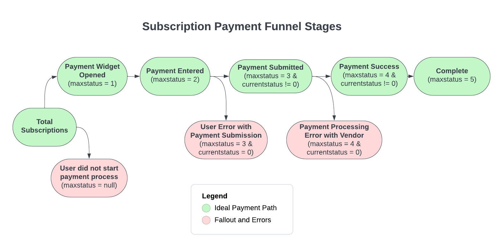

### Payment funnel analysis with multiple CTEs
#### Business problem:
The product manager has requested a payment funnel analysis from the analytics team; she wants to understand what the furthest point in the payment process users are getting to and where users are falling out of the process. She wants to have full visibility into each possible stage of the payment process from the user's point of view. 
 
Here's the payment process a user goes through when signing up for a subscription:
 
1. The user opens the widget to initiate payment process.
2. The user types in credit card information.
3. The user clicks the submit button to complete their part of the payment process.
4. The product sends the data to the third-party payment processing company.
5. The payment company completes the transaction and reports back with "complete."
 
This process is converted into statusids using the following mapping in the statusdefinition table below:

```sql
select * from statusdefinition;
```

```
----------------------------------
| STATUSID | DESCRIPTION         |
----------------------------------
| 0        | Error               |
| 1        | PaymentWidgetOpened |
| 2        | PaymentEntered      |
| 3        | PaymentSubmitted    |
| 4        | PaymentSuccess      |
| 5        | Complete            |
----------------------------------
```

As subscriptions move through the statuses, the movements are logged in the `paymentstatuslog` table using the `statusid`. Users can go back and forth and move through statuses multiple times. Check out the example below for `subscriptionid = '38844'`. Notice how they move through a few statuses, hit an error, restart the process, and then finally complete their payment.

```sql
select * 
from paymentstatuslog
where subscriptionid = '38844'
order by movementdate;
```

```
------------------------------------------------------------------------
| STATUSMOVEMENTID | SUBSCRIPTIONID | STATUSID | MOVEMENTDATE          |
------------------------------------------------------------------------
| 39112775         | 38844          | 1        | 2023-12-02 02:33:13.0 |
| 13223956         | 38844          | 2        | 2023-12-02 02:33:22.0 |
| 53176031         | 38844          | 3        | 2023-12-02 02:33:29.0 |
| 1694206          | 38844          | 0        | 2023-12-02 02:33:31.0 |
| 59634923         | 38844          | 2        | 2023-12-02 02:33:46.0 |
| 31401200         | 38844          | 3        | 2023-12-02 02:33:51.0 |
| 94425726         | 38844          | 4        | 2023-12-02 02:33:53.0 |
| 78460513         | 38844          | 5        | 2023-12-02 02:33:55.0 |
------------------------------------------------------------------------
```


#### Creating the paymentfunnelstage logic:

I've given you the code for the paymentfunnelstage column, but here's the logic behind it. You're welcome to use the code I've given you or write it yourself using the funnel diagram provided.
 
To determine a subscription's paymentfunnelstage, we want to consider its max statusid because this will show us the furthest point in the workflow that they successfully reached—regardless of whether they:

    completed the process,
    hit an error and started the process over,
    or hit an error, gave up, and left the workflow.

In addition to the max status reached, we also want to consider if the subscription is currently stuck in an error using the currentstatus column from the subscriptions table.
 
If a user reaches statusid = 3 but submits an incorrect card number, the transaction will be stopped and they will see an error message. The user will then need to restart the process and use the correct information. This is considered a user error. If a user reaches statusid = 4 and submits correct payment information, the data is sent to a third-party payment company. If they are unable to process the data and complete the transaction due to an error on their end, it will produce an error message to the user. This is considered a vendor error.
 
We want to differentiate between these two different user fallout reasons in our funnel analysis, because they point to different business actions to fix them. Here's a visualization of the logic needed:



#### Task: 
Count the number of subscriptions in each paymentfunnelstage as outlined in the code that I've given you by incorporating the the maxstatus reached and currentstatus per subscription. Use the paymentstatuslog and subscriptions tables.


 
